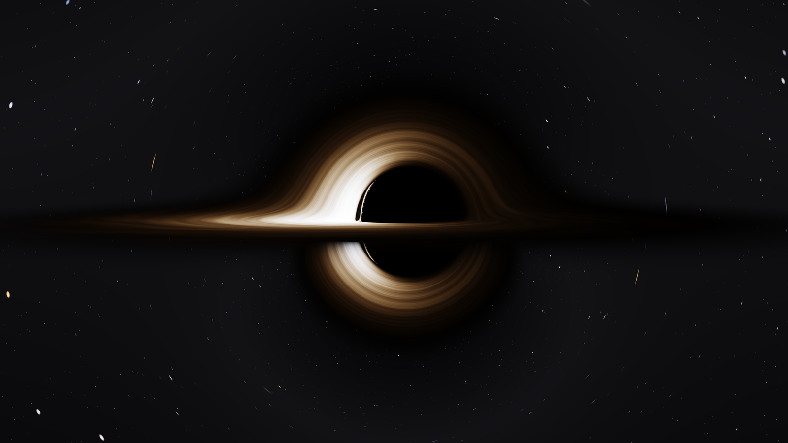
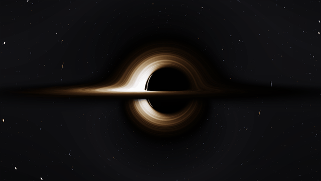
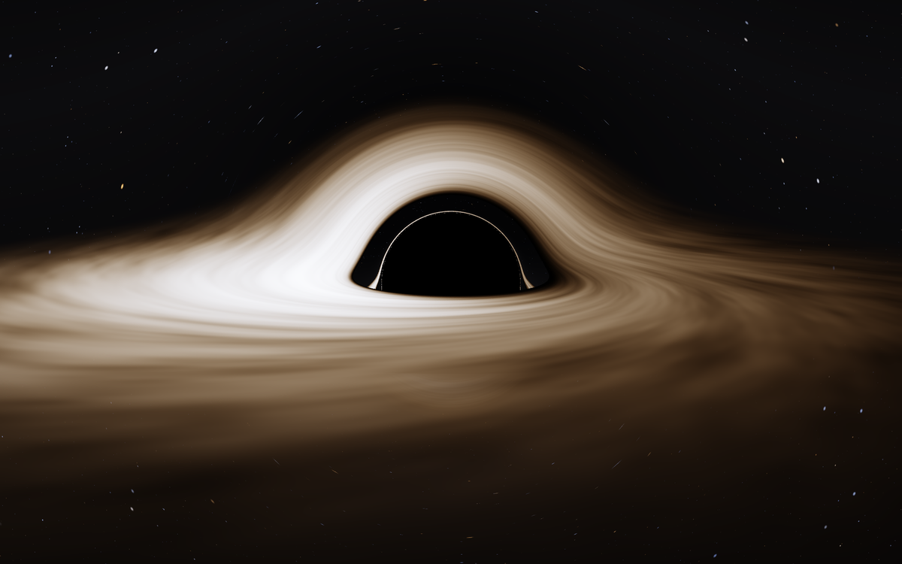
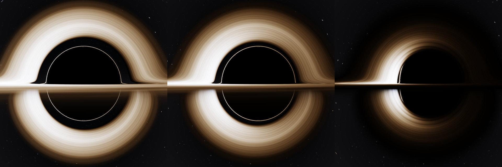
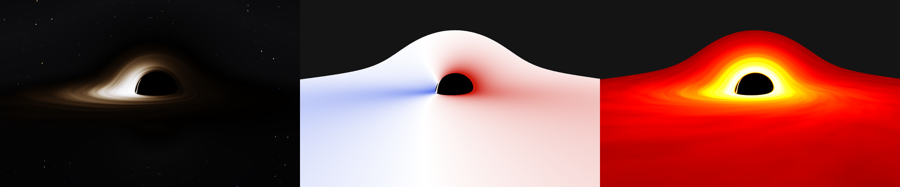

# Kerr black hole simulator

[](https://github.com/ablesarodriguez/kerr-black-hole-simulator/actions/workflows/ci.yml)

A real-time simulator of a spinning (Kerr) black hole and its accretion disk. Every pixel is a light
ray integrated through curved spacetime on the GPU: there is no pre-baked lensing texture and no
"bend the ray a bit" approximation. The physics is implemented twice, in GLSL and in double-precision
C++, and tested against analytical results from general relativity.



*Spin a = 0.9 M, camera at 100 M, almost edge-on. The arc above the shadow is the far side of the
disk, bent over the hole; the arc below is its underside. The left side is brighter because that gas
moves towards the camera.*



C++17 · OpenGL 3.3 / GLSL · [raylib](https://www.raylib.com) · CMake. 125 fps at 1920×1080 on an
RTX 3060.

## What it shows

| | |
| --- | --- |
|  | **No spin (a = 0).** The classic picture first computed by Luminet in 1979: the disk behind the hole appears above it, a thin photon ring hugs the shadow, and the approaching side is brighter. |



*Same camera, spin a/M = 0, 0.5 and 0.95. As the hole spins up, the shadow becomes D-shaped and shifts
sideways (frame dragging), the inner edge of the disk moves inwards with the ISCO, and the Doppler
contrast grows because the inner gas orbits faster.*



*The three view modes (key `V`): the image, the redshift factor g (blue: light shifted to higher
frequency, red: lower) and the emitted temperature of the disk.*

All images in this README are unedited output of the simulator, produced with its `--shot` option
and downscaled 2× for antialiasing.

## The physics

Units are G = c = M = 1, so lengths are in units of the black hole mass.

**Spacetime.** The Kerr metric in Cartesian Kerr-Schild coordinates, which are regular across the
horizon (no coordinate singularity where Boyer-Lindquist coordinates break down):

$$g_{\mu\nu} = \eta_{\mu\nu} + f\, l_\mu l_\nu, \qquad f = \frac{2 r^3}{r^4 + a^2 Z^2}, \qquad
l_\mu = \left(1,\; -\frac{rX - aY}{r^2 + a^2},\; -\frac{rY + aX}{r^2 + a^2},\; -\frac{Z}{r}\right)$$

where r is defined by $\frac{X^2 + Y^2}{r^2 + a^2} + \frac{Z^2}{r^2} = 1$.

**Light rays.** Null geodesics, from the Hamiltonian

$$H = \tfrac12\, g^{\mu\nu} p_\mu p_\nu = \tfrac12\left[-E^2 + |\mathbf P|^2 - f\,(E + \mathbf l\cdot\mathbf P)^2\right] = 0$$

Hamilton's equations $\dot X^i = \partial H / \partial P_i$, $\dot P_i = -\partial H / \partial X^i$
are integrated with fourth-order Runge-Kutta, backwards in time from the camera, with a step that
shrinks near the horizon. The gradients are analytical. A ray ends in the horizon (shadow), on the
disk, or at infinity (sky).

**Camera.** A zero-angular-momentum observer (static when a = 0) with a local orthonormal frame built
by Gram-Schmidt with the metric. This gives the correct aberration and gravitational blueshift for a
camera close to the hole.

**Disk.** Geometrically thin and optically thick, on circular equatorial orbits, with its inner edge
at the innermost stable circular orbit of Bardeen, Press and Teukolsky (6 M for a = 0, 2.32 M for
a = 0.9). The emitted flux is the Novikov-Thorne / Page-Thorne solution with zero torque at the inner
edge, and each ring radiates as a blackbody with $T \propto F^{1/4}$.

**Redshift.** The exact factor between emitted and observed frequency, combining Doppler and
gravitational shifts:

$$g = \frac{\nu_\text{obs}}{\nu_\text{emit}} = \frac{1}{u^t\,(E - \Omega L_z)}, \qquad
\Omega = \frac{1}{r^{3/2} + a}, \qquad
u^t = \frac{r^{3/2} + a}{r^{3/4}\sqrt{r^{3/2} - 3 r^{1/2} + 2a}}$$

**Colour and brightness.** $I_\nu / \nu^3$ is conserved along a ray, so a blackbody at temperature T
is observed as an exact blackbody at g·T. The shader integrates that Planck spectrum against the CIE
1931 colour matching functions, which yields both the colour shift and the $g^4$ brightness change
with no extra assumptions.

**Time.** The disk pattern is evaluated at the moment each photon was emitted, so the light-travel
delay across the image is included.

## Validation

`tests/physics_tests.cpp` checks the C++ implementation against closed-form results. Run on the
simulator's own step size:

| Check | Computed | Exact | Relative error |
| --- | --- | --- | --- |
| Shadow radius, static observer at 20 M, a = 0 | 14.269052° | 14.269027° | 2 × 10⁻⁶ |
| Shadow edge, a = 0.9, prograde (Bardeen 1973) | 2.844433 M | 2.844421 M | 4 × 10⁻⁶ |
| Shadow edge, a = 0.9, retrograde | −6.832345 M | −6.832319 M | 4 × 10⁻⁶ |
| Shadow edge, a = 0.95, prograde | 2.582244 M | 2.582212 M | 1 × 10⁻⁵ |
| Drift of H along a grazing ray, a = 0.9 | | 0 | 8 × 10⁻⁶ |
| Drift of L_z along a grazing ray, a = 0.9 | | 0 | 2 × 10⁻⁵ |
| ISCO radius, a = 0.9 | 2.320883 M | 2.320883 M | < 10⁻⁷ |
| Peak of the disk flux, a = 0 | 9.552 M | 9.548 M | 4 × 10⁻⁴ |

The suite has 29 checks in total, including the analytical gradients against finite differences and
the a = 0 limit against an independent Schwarzschild integrator.

`tools/validate.py` then renders the GLSL shader offscreen and compares it with exact values and,
pixel by pixel, with a double-precision CPU renderer (`tools/reference_render.cpp`) that shares no
code with the shader.

## Build

Requirements: CMake 3.16 or newer, a C++17 compiler and a GPU with OpenGL 3.3.

```bash
cmake -S . -B build
cmake --build build
```

**Windows (MinGW-w64).** A static raylib 6.0 is bundled in `simulator/lib`, so nothing else is
needed. If CMake does not pick MinGW by default, add `-G "MinGW Makefiles"` or `-G Ninja`. This is
the configuration the project is developed and tested on (Windows 11, GCC 13).

**Linux.** CMake uses an installed raylib if there is one and otherwise downloads and builds
raylib 5.5, which needs the usual X11 and OpenGL development packages. On Debian or Ubuntu:

```bash
sudo apt install build-essential cmake git libgl1-mesa-dev libx11-dev libxrandr-dev libxinerama-dev libxcursor-dev libxi-dev
```

## Run

```bash
./build/simulator
```

| Key | Action |
| --- | --- |
| WASD + mouse | Move the camera |
| R | Spin on / off (returns to the last value, 0.9 by default) |
| Left / Right | Spin −0.05 / +0.05 (between −0.95 and 0.95; negative means a retrograde disk) |
| 1 / 2 | Maximum disk temperature ÷1.25 / ×1.25 |
| Up / Down | Exposure |
| V | View mode: image, redshift map, temperature map |
| T | Disk turbulence on / off |
| PgUp / PgDn | Speed of time (M per second) |

Offscreen rendering at any resolution, and benchmarking:

```bash
./build/simulator --shot hero.png --size 3200 1800 --spin 0.9 --cam 0 5 100 --fov 22 --exposure 2
./build/simulator --shot frame.png --frames 120 --dt 0.05 --orbit 30 --spin 0.9
./build/simulator --bench 300 --size 1920 1080 --spin 0.9
```

Tests:

```bash
./build/physics_tests
pip install moderngl numpy pillow
python tools/validate.py --build build
```

Frame time on an RTX 3060 with the default camera: 3.3 ms at 1000×800, 7.9 ms at 1920×1080 and
13.9 ms at 2560×1440.

## What is not real

- **The disk model.** A razor-thin, opaque disk is the textbook model for a luminous quasar, not for
  the black holes imaged so far. M87* and Sgr A* have hot, thick, nearly transparent flows whose
  image requires GRMHD simulations and radiative transfer.
- **The turbulence** is procedural noise carried around at the orbital velocity. It is there to make
  the rotation visible and has no physical model behind it.
- **The temperature.** The default peak of 6500 K is chosen so that colours are visible. A real disk
  is at 10⁵ K or more and would look almost uniformly blue-white to the eye. The key `2` raises it.
- **The sky** is a procedural star field, not a star catalogue.
- **Spin** is limited to |a| ≤ 0.95 M, the range in which the single-precision shader has been
  validated.
- No polarisation, no limb darkening, no emission from inside the ISCO, and the camera is always at
  rest.

## Layout

| Path | Contents |
| --- | --- |
| `simulator/blackhole.fs` | The fragment shader: geodesic integrator, disk, sky, colour |
| `simulator/main.cpp` | Window, camera, controls, offscreen rendering |
| `common/KerrPhysics.h` | The same physics in double-precision C++ |
| `tests/physics_tests.cpp` | Tests against analytical results |
| `tools/` | CPU reference renderer and shader validation scripts |
| `prototype/` | The first version: a CPU ray marcher with a Schwarzschild effective force, kept for history |

## References

- J. B. Hartle, *Gravity: An Introduction to Einstein's General Relativity* (2003), chapter 9.
- J. M. Bardeen, W. H. Press, S. A. Teukolsky, "Rotating black holes: locally nonrotating frames,
  energy extraction, and scalar synchrotron radiation", *ApJ* 178 (1972).
- J. M. Bardeen, "Timelike and null geodesics in the Kerr metric", in *Black Holes* (1973).
- D. N. Page, K. S. Thorne, "Disk-accretion onto a black hole", *ApJ* 191 (1974).
- J.-P. Luminet, "Image of a spherical black hole with thin accretion disk", *A&A* 75 (1979).
- O. James, E. von Tunzelmann, P. Franklin, K. S. Thorne, "Gravitational lensing by spinning black
  holes in astrophysics, and in the movie Interstellar", *CQG* 32 (2015).
- C. Wyman, P.-P. Sloan, P. Shirley, "Simple analytic approximations to the CIE XYZ color matching
  functions", *JCGT* 2 (2013).

## License

MIT, see [LICENSE](LICENSE). The bundled raylib headers and library (`simulator/include`,
`simulator/lib`) are © Ramon Santamaria and contributors, under the zlib license.
